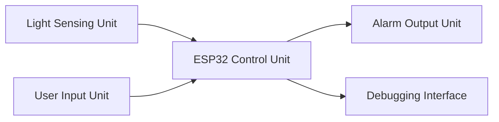
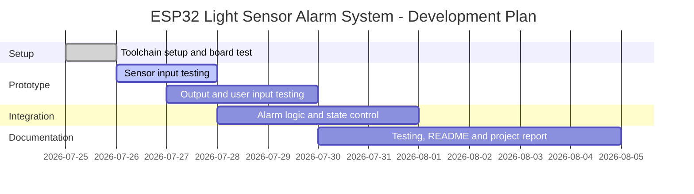

# ESP32 Light Sensor Alarm System

ESP32-based light sensor alarm system using an LDR sensor module, ADC input, GPIO output, buzzer alarm, button mute/reset logic, and Serial Monitor debugging.

## Project Aim

The aim of this project is to build a small embedded system that detects changes in light level and triggers an alarm when the measured light value crosses a defined threshold.

This project is also used to practise core embedded systems concepts, including:

- GPIO input and output
- ADC sensor reading
- Threshold-based control logic
- Button input and debounce
- LED and buzzer output
- Serial Monitor debugging
- Basic state logic

## Current Status

This project is currently in the setup and sensor testing stage.

Completed:

- GitHub repository created
- Arduino IDE 2.3.10 installed
- ESP32 board package installed
- ESP32 detected through COM port
- Serial Monitor tested
- LDR sensor module identified with `AO`, `DO`, `GND`, and `VCC` pins

Next:

- Connect LDR module `AO` to ESP32 `GPIO34`
- Read analog sensor values using Serial Monitor
- Record sensor values under different light conditions
- Add LED output control

## System Overview

The system follows an input-process-output structure.

The light sensing unit detects the environmental light level. The ESP32 control unit reads the sensor input, processes the value, and decides whether the alarm condition is active. The alarm output unit provides visual and sound alerts. The user input unit will be used for mute or reset control. The debugging interface is used to observe sensor readings and system behaviour during development.

## System Block Diagram

*Figure 1. Overview of the ESP32 light sensor alarm system.*

### Block Description

| Block | Purpose |
|---|---|
| Light Sensing Unit | Detects environmental light level. |
| ESP32 Control Unit | Processes sensor input and controls system behaviour. |
| Alarm Output Unit | Provides visual and sound alert when the alarm condition is active. |
| User Input Unit | Allows mute or reset control. |
| Debugging Interface | Displays sensor values and system status during development. |

Detailed pin connections and wiring information will be documented separately.

## Development Plan

This development plan is flexible and may be adjusted depending on hardware availability, testing results, and study schedule.

*Figure 2. Flexible development plan for the ESP32 light sensor alarm system.*

## Hardware

- ESP32 development board
- ESPBlock expansion board
- LDR sensor module
- LED
- Button
- Buzzer
- Jumper wires
- USB cable

## Software

- Arduino IDE 2.3.10
- ESP32 board package by Espressif Systems
- GitHub for version control and documentation

## Planned Features

- Read light level using the LDR module analog output
- Display sensor values in Serial Monitor
- Use a threshold to detect low-light conditions
- Turn on LED when the alarm condition is active
- Activate buzzer alarm
- Add button mute/reset functionality
- Implement basic states: `NORMAL`, `ALARM`, and `MUTED`
- Record test results and troubleshooting notes

## Future Improvements

Possible future improvements include:

- Wi-Fi monitoring
- Web dashboard
- Data logging
- Adjustable threshold
- Comparison between analog output `AO` and digital output `DO`
