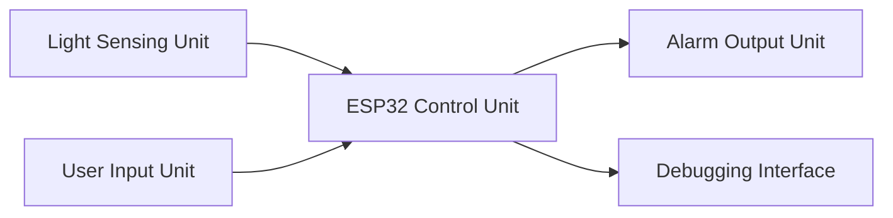
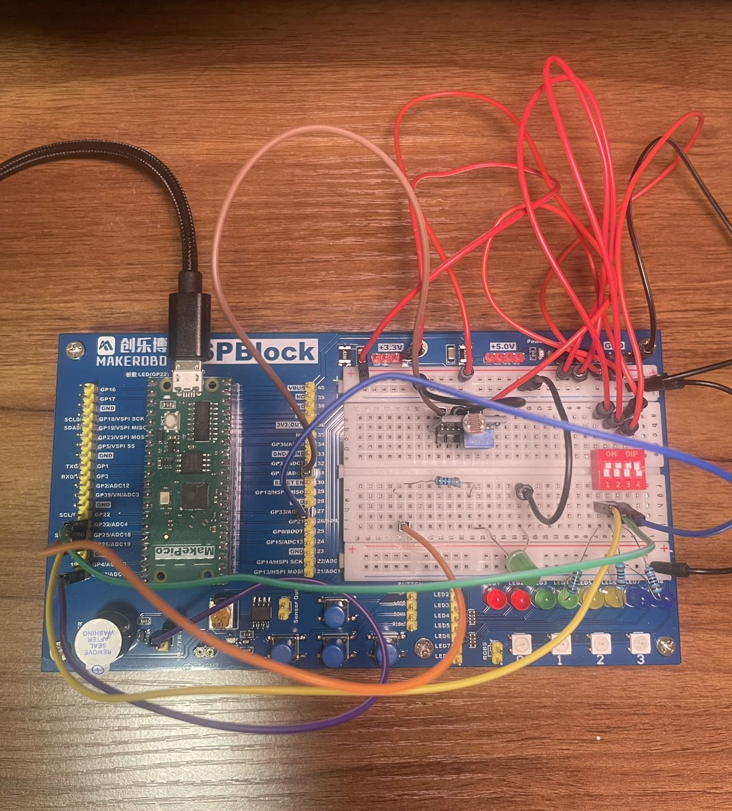
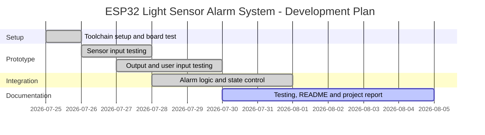

# ESP32 Light Sensor Alarm System

ESP32-based light sensor alarm system using an LDR sensor module, ADC input, GPIO output, buzzer alarm, DIP switch control, and Serial Monitor debugging.

## Project Aim

The aim of this project is to build a small embedded system that detects changes in light level and triggers an alarm when the measured light value crosses a defined threshold.

This project is also used to practise core embedded systems concepts, including:

- GPIO input and output
- ADC sensor reading
- Threshold-based control logic
- LED and buzzer output
- DIP switch input control
- Serial Monitor debugging
- Basic control logic

## Current Status

This project currently has a working prototype. The ESP32 reads analog values from the LDR sensor module and triggers an external LED and the ESPBlock onboard buzzer when a confirmed dark condition is detected. The alarm behaviour can also be controlled using three DIP switches.

## Implemented Features

- Reads analog light level from an LDR sensor module using ESP32 ADC.
- Uses a threshold value to detect dark conditions.
- Uses a second reading after a confirmation delay to reduce false triggering.
- Controls an external LED as a visual alarm output.
- Controls the ESPBlock onboard buzzer as an audible alarm output.
- Uses DIP switch 1 to enable or disable the alarm system.
- Uses DIP switch 2 to enable or mute the buzzer.
- Uses DIP switch 3 to enable or disable the LED.
- Displays sensor values and system status in Serial Monitor.

## System Overview

The system follows an input-process-output structure.

The light sensing unit detects the environmental light level using an LDR sensor module. The ESP32 control unit reads the analog sensor value, processes the threshold logic, and decides whether the alarm condition is active. The alarm output unit provides visual and sound alerts using an external LED and the ESPBlock onboard buzzer. The user input unit allows the alarm behaviour to be configured using three DIP switches. The debugging interface is used to observe sensor readings and system status during development.

## System Block Diagram

*Figure 1. Overview of the ESP32 light sensor alarm system.*

### Block Description

| Block | Purpose |
|---|---|
| Light Sensing Unit | Detects environmental light level using the LDR sensor module. |
| ESP32 Control Unit | Reads the sensor input, processes the threshold logic, and controls system behaviour. |
| Alarm Output Unit | Provides visual and sound alerts using an external LED and the ESPBlock onboard buzzer. |
| User Input Unit | Allows alarm enable, buzzer mute, and LED enable control using DIP switches. |
| Debugging Interface | Displays sensor values and system status during development. |

*Table 1. Block description of the ESP32 light sensor alarm system.*

## Hardware

- ESP32 development board
- ESPBlock expansion board
- LDR sensor module
- External LED
- 330Ω resistor for LED current limiting
- 10kΩ resistors for DIP switch pull-down inputs
- 4-position DIP switch
- ESPBlock onboard buzzer
- Jumper wires
- USB cable

## Hardware Prototype

*Figure 2. Final V1 working prototype showing the LDR sensor module, external LED, ESPBlock onboard buzzer, and DIP switch controls.*

## Demo Video

A short V1 demonstration video is available here:

[Watch the V1 demo video](https://youtu.be/25t3WMKX8aA)

*Video 1. V1 demonstration of the ESP32 light sensor alarm system.*

## Pin Assignment

| Component | ESP32 Pin | Purpose |
|---|---:|---|
| LDR module `AO` | `GPIO34` | Analog light-level input |
| External LED | `GPIO25` | Visual alarm output |
| ESPBlock onboard buzzer | `GPIO27` | Audible alarm output |
| DIP switch 1 | `GPIO26` | Alarm enable control |
| DIP switch 2 | `GPIO32` | Buzzer mute control |
| DIP switch 3 | `GPIO33` | LED enable control |

*Table 2. Pin assignment for the current working prototype.*

## Wiring Reference

The wire colours below describe the current V1 prototype wiring shown in Figure 2.

| Wire Colour | Connection |
|---|---|
| Red wire | VCC / power connection |
| Black wire | GND connection |
| Brown wire | LDR module `AO` connected to `GPIO34` |
| Orange wire | External LED connected to `GPIO25` |
| Purple wire | ESPBlock onboard buzzer controlled by `GPIO27` |
| Yellow wire | DIP switch 1 connected to `GPIO26` |
| Green wire | DIP switch 2 connected to `GPIO32` |
| Blue wire | DIP switch 3 connected to `GPIO33` |

*Table 3. Wiring reference for the V1 hardware prototype photo.*

## Testing Summary

| Test Area | Description | Status |
|---|---|---|
| GPIO output | External LED blink test using `GPIO25` | Passed |
| Analog input | LDR module `AO` reading using `GPIO34` | Passed |
| Threshold control | LED controlled by LDR threshold | Passed |
| Buzzer output | ESPBlock onboard buzzer controlled by `GPIO27` | Passed |
| Alarm integration | LDR triggers LED and buzzer together | Passed |
| False trigger reduction | Threshold refined to `2000` with confirmation delay | Passed |
| Alarm enable switch | DIP switch 1 enables or disables the system | Passed |
| Buzzer mute switch | DIP switch 2 enables or mutes buzzer output | Passed |
| LED enable switch | DIP switch 3 enables or disables LED output | Passed |

*Table 4. Testing summary for the current working prototype.*

## Project Documentation

- [Development Log](development_log.md)
- [Final Testing Notes](docs/final_testing_notes.md)

## Development Plan

This development plan is flexible and may be adjusted depending on hardware availability, testing results, and study schedule.

*Figure 3. Flexible development plan for the ESP32 light sensor alarm system.*

## Development Environment

- Arduino IDE 2.3.10
- ESP32 board package by Espressif Systems
- Board: ESP32 Dev Module
- Serial Monitor baud rate: 115200
- GitHub for version control and documentation

## Additional Experiment

An additional AO vs DO comparison test is included in `code/ao_do_comparison_test/`. This test compares the LDR module analog output `AO` with its digital comparator output `DO` to show the difference between continuous ADC readings and hardware-comparator digital signals.

## Future Improvements

Possible future improvements include:

- Adjustable threshold using software configuration or additional input control
- Improved Serial Monitor output formatting for clearer debugging
- More reliable user input hardware, such as a breadboard-friendly switch module or a soldered prototyping board
- Automated light-level data logging for recording sensor values and alarm states
- Wi-Fi monitoring
- Web dashboard
